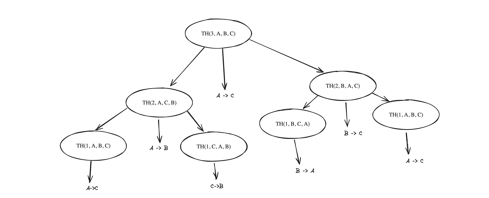

# Hanoi Tower


Simple hanoi tower solution using *stack* and *recusivity*

Inspired in [this](stack.pdf) IME USP homework.

## Compile and run
### Makefile
```shell
$ ~ make
```
Will genarate a binary called `hanoi`
```shell
$ ~ /hanoi <arguments>
```

## Docker 
```shell
docker build -t gcc:hanoi . 
docker run --rm -it gcc:hanoi <ARGUMENTS>
```


## Usage

```shell
$ ~ ./hanoi -h

Hanoi Tower solution!
    -r Use recursive algorithm
    -s Use stack algorithm and shows the stack
    -n Number of disks
    -h Show help
```


